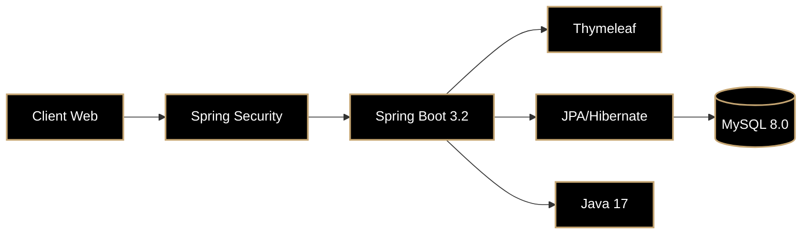

<div align="center">


<br />
<br />

# ✦ ＣＡＭＰＵＳ ＤＡＮＧ ＦＯＯＤ ✦

### ⋆༺𓆩  ＰＬＡＴＦＯＲＭＥ  ＤＥ  ＧＥＳＴＩＯＮ  ＧＡＳＴＲＯＮＯＭＩＱＵＥ  𓆪༻⋆

<br />

<sub>**L'EXCELLENCE CULINAIRE CAMEROUNAISE — ÉLEVÉE À L'ÉTAT D'ART TECHNOLOGIQUE**</sub>

<br />
<br />


<br />
<br />

[](https://github.com)
[](https://github.com)
[](https://github.com)
[](https://github.com)

<br />


<br />
<br />

**[ ۞  FONCTIONNALITÉS  ۞ ](#-fonctionnalités-clés)** &nbsp;&nbsp;&nbsp;&nbsp;✦&nbsp;&nbsp;&nbsp;&nbsp; **[ ۞  TECHNOLOGIES  ۞ ](#-stack-technologique)** &nbsp;&nbsp;&nbsp;&nbsp;✦&nbsp;&nbsp;&nbsp;&nbsp; **[ ۞  INSTALLATION  ۞ ](#-déploiement--installation)** &nbsp;&nbsp;&nbsp;&nbsp;✦&nbsp;&nbsp;&nbsp;&nbsp; **[ ۞  API  ۞ ](#-api--endpoints)** &nbsp;&nbsp;&nbsp;&nbsp;✦&nbsp;&nbsp;&nbsp;&nbsp; **[ ۞  ROADMAP  ۞ ](#-vision--roadmap)**

<br />
<br />


</div>

<br />
<br />
<br />

> <div align="center">
> <sub>✦ ＣＡＭＰＵＳ ＤＡＮＧ ＦＯＯＤ ✦</sub>
> </div>
> 
> **Une infrastructure technologique de pointe** dédiée aux établissements gastronomiques du campus universitaire de Dang (Ngaoundéré).
> 
> De la curation algorithmique des menus à la réservation en temps réel, jusqu'à la simulation transactionnelle omnicanale,
> cette plateforme incarne la convergence parfaite entre **patrimoine culinaire camerounais** et **ingénierie logicielle haut de gamme**.

<br />
<br />

---

<br />

<div align="center">

<br />
<sub>✦  ＦＯＮＣＴＩＯＮＮＡＬＩＴÉＳ  ＣＬÉＳ  ✦</sub>
<br />

</div>

<br />

## ◈ ＣＯＵＣＨＥ ＣＬＩＥＮＴ — *Ｌ'ＥＸＰÉＲＩＥＮＣＥ*

<table>
<tr>
<td width="50%">

<br />

### ⌘ ＡＲＣＨＩＴＥＣＴＵＲＥ ＶＩＳＵＥＬＬＥ

<sub>**Dark Matter Aesthetic**</sub>

```
◈ Profondeur chromatique infinie
◈ Accents auriques calibrés
◈ Micro-interactions haptiques
◈ Fluidité cristalline (120fps)
```

</td>
<td width="50%">

<br />

### ⌘ ＣＯＧＮＩＴＩＯＮ

<sub>**Système spectral**</sub>

```
◈ Filtrage taxonomique temps réel
◈ Classification par établissement
◈ Algorithme de recommandation
◈ Indexation sémantique
```

</td>
</tr>
<tr>
<td width="50%">

<br />

### ⌘ ＴＲＡＮＳＡＣＴＩＯＮ

<sub>**Moteur quantique**</sub>

```
◈ Panier LocalStorage ultra-rapide
◈ Calculs instantanés <300ms
◈ Mutation atomique des quantités
◈ Validation transactionnelle
```

</td>
<td width="50%">

<br />

### ⌘ ＰＡＩＥＭＥＮＴ

<sub>**Couche holistique**</sub>

```
◈ MTN Mobile Money
◈ Orange Money
◈ VISA/Mastercard
◈ Simulation transactionnelle
```

</td>
</tr>
</table>

<br />

## ◈ ＣＯＵＣＨＥ ＡＤＭＩＮ — *ＬＡ ＧＯＵＶＥＲＮＡＮＣＥ*

<br />

<table align="center">
<tr>
<th align="center" width="50%"><sub>⌘ ＣＨＥＦ</sub></th>
<th align="center" width="50%"><sub>⌘ ＳＥＲＶＥＲ</sub></th>
</tr>
<tr>
<td>

```ruby
◈ MAÎTRISE CATALOGUE
◈ CRUD MENUS/PLATS
◈ DASHBOARDS PRÉDICTIFS
◈ EXPORT DATA
```

</td>
<td>

```ruby
◈ TRACKING COMMANDES
◈ STATUTS TEMPS RÉEL
◈ GESTION SALLE
◈ ALERTES PUSH
```

</td>
</tr>
</table>

<br />

<div align="center">
<sub>🛡️ <b>ZERO-TRUST SECURITY</b> — SPRING SECURITY + BCrypt + JWT + SESSION MANAGEMENT</sub>
</div>

<br />

---

<br />

<div align="center">

<br />
<sub>✦  ＳＴＡＣＫ  ＴＥＣＨＮＯＬＯＧＩＱＵＥ  ✦</sub>
<br />

</div>

<br />

<details>
<summary><b>⌘ ＡＲＣＨＩＴＥＣＴＵＲＥ ＮＵＣＬÉＡＩＲＥ — ＤéＰＬＯＹＥＲ ＬＡ ＭＡＴＲＩＣＥ</b></summary>
<br />



<br />

```yaml
𝗡𝗢𝗬𝗔𝗨 𝗘𝗧 𝗕𝗔𝗖𝗞𝗘𝗡𝗗:
  ☕ Core: Java JDK 17
  🍃 Framework: Spring Boot 3.2.0
  🔐 Sécurité: Spring Security 6.x
  💾 Persistance: Spring Data JPA 3.x / Hibernate
  🗄️ Base de données: MySQL 8.0 / H2
  🔧 Build: Maven 3.9+
  📦 Outils: Lombok, Bean Validation, MapStruct

𝗜𝗡𝗧𝗘𝗥𝗙𝗔𝗖𝗘 𝗙𝗥𝗢𝗡𝗧𝗘𝗡𝗗:
  🎨 Rendu: Thymeleaf 3.1
  📐 Structure: HTML5 sémantique
  🎭 Style: CSS3 (Tailwind-inspired custom)
  ⚡ Logique: JavaScript ES6+ / Alpine.js 3.x
  🖼️ Ressources: Font Awesome 6, Google Fonts
  📄 PDF: html2pdf.js / jsPDF

𝗗𝗘𝗩𝗢𝗣𝗦 𝗘𝗧 𝗤𝗨𝗔𝗟𝗜𝗧𝗘́:
  📦 Versioning: Git / Conventional Commits
  🧪 Tests: JUnit 5, MockMvc, Testcontainers
  📚 Documentation: OpenAPI 3.0 / Swagger
  📊 Monitoring: Spring Actuator / Prometheus
  🐳 Conteneurisation: Docker / Docker Compose
```

</details>

<br />

<details>
<summary><b>⌘ ＡＲＢＯＲＥＳＣＥＮＣＥ — ＤéＰＬＯＹＥＲ ＬＡ ＳＴＲＵＣＴＵＲＥ</b></summary>
<br />

```tree
campus-dang-food/
├── 📁 .github/                    # Workflows CI/CD
│   └── workflows/
│       ├── build.yml
│       └── deploy.yml
├── 📁 src/
│   ├── 📁 main/
│   │   ├── 📁 java/
│   │   │   └── 📁 com/campusdang/restauration/
│   │   │       ├── 📁 config/     # Zero-trust / Data seeding
│   │   │       ├── 📁 controller/ # REST endpoints
│   │   │       ├── 📁 dto/        # Data Transfer Objects
│   │   │       ├── 📁 exception/  # Global error handling
│   │   │       ├── 📁 model/      # JPA entities
│   │   │       ├── 📁 repository/ # Spring Data interfaces
│   │   │       ├── 📁 security/   # JWT / Session
│   │   │       └── 📁 service/    # Business orchestration
│   │   └── 📁 resources/
│   │       ├── 📁 db/             # Migrations
│   │       ├── 📁 static/
│   │       │   ├── 📁 css/        # Design system
│   │       │   ├── 📁 js/         # ES6 modules
│   │       │   └── 📁 assets/     # Optimized media
│   │       └── 📁 templates/      # Thymeleaf views
│   └── 📁 test/                   # Unit / Integration tests
├── 📁 docker/                     # Container configs
├── 📄 docker-compose.yml
├── 📄 Dockerfile
├── 📄 pom.xml
└── 📄 README.md
```

</details>

<br />

---

<br />

<div align="center">

<br />
<sub>✦  ＤéＰＬＯＩＥＭＥＮＴ  ＆  ＩＮＳＴＡＬＬＡＴＩＯＮ  ✦</sub>
<br />

</div>

<br />

## ◈ ＲＥＱＵＩＳＩＴＳ

<div align="center">

| 𝗖𝗢𝗠𝗣𝗢𝗦𝗔𝗡𝗧𝗘 | 𝗩𝗘𝗥𝗦𝗜𝗢𝗡 | 𝗣𝗥é𝗥𝗘𝗤ＵＩＳ |
|:---|:---:|---|
| **JDK** | `17+` | Java Development Kit |
| **MySQL** | `8.0+` | Base de données relationnelle |
| **Maven** | `3.9+` | Gestionnaire de build |
| **Docker** | `24+` | Conteneurisation (optionnel) |
| **Git** | `2.40+` | Contrôle de version |

</div>

<br />

## ◈ ＤéＰＬＯＩＥＭＥＮＴ ＲＡＰＩＤＥ

<details>
<summary><b>⌘ ＭÉＴＨＯＤＥ ＮＡＴＩＶＥ</b></summary>
<br />

```bash
# 1. Acquisition
git clone https://github.com/votre-utilisateur/campus-dang-food.git
cd campus-dang-food

# 2. Base de données
docker run -d --name mysql-campus \
  -e MYSQL_ROOT_PASSWORD=root \
  -e MYSQL_DATABASE=campusdangdb \
  -p 3306:3306 \
  mysql:8.0

# 3. Configuration
cp src/main/resources/application-example.properties \
   src/main/resources/application-prod.properties

# 4. Build
./mvnw clean package -DskipTests

# 5. Lancement
java -jar target/campus-dang-food-*.jar \
  --spring.profiles.active=prod
```

</details>

<br />

<details>
<summary><b>⌘ ＭÉＴＨＯＤＥ ＤＯＣＫＥＲ</b></summary>
<br />

```bash
# Build de l'image
docker build -t campus-dang-food:latest .

# Lancement du stack complet
docker-compose up -d

# Vérification
docker-compose ps
curl http://localhost:8080/actuator/health
```

</details>

<br />

## ◈ ＣＲＥＤＥＮＴＩＡＬＳ — *ＡＣＣèＳ ＩＮＩＴＩＡＵＸ*

<div align="center">

| 𝗘𝗠𝗔𝗜𝗟 | 𝗣𝗔𝗦𝗦𝗪𝗢𝗥𝗗 | 𝗥𝗢𝗟𝗘 |
|:---|:---:|:---|
| `chef@campusdang.cm` | `chef123` | **CHEF** |
| `serveur@campusdang.cm` | `serveur123` | **SERVER** |
| `jean@email.com` | `123456` | **CLIENT** |

</div>

<br />

## ◈ ＶＡＲＩＡＢＬＥＳ Ｄ'ＥＮＶＩＲＯＮＮＥＭＥＮＴ

```bash
# Production
export DB_URL=jdbc:mysql://localhost:3306/campusdangdb
export DB_USERNAME=prod_user
export DB_PASSWORD=$(openssl rand -base64 32)
export JWT_SECRET=$(openssl rand -hex 64)
export APP_NAME="Campus Dang Food"
export CORS_ORIGINS=https://app.campusdang.cm
export LOG_LEVEL=INFO
```

<br />

---

<br />

<div align="center">

<br />
<sub>✦  ＡＰＩ  ＆  ＥＮＤＰＯＩＮＴＳ  ✦</sub>
<br />

</div>

<br />

<details>
<summary><b>⌘ 𝗥𝗢𝗨𝗧𝗔𝗚𝗘 𝗣𝗨𝗕𝗟𝗜𝗖</b></summary>
<br />

```http
GET    /                              → 200  Portail d'accueil
GET    /restaurants                   → 200  Liste des établissements
GET    /restaurants/{id}              → 200  Détail établissement
GET    /restaurants/{id}/menu/{type}  → 200  Consultation carte
GET    /reservations/nouvelle         → 200  Formulaire réservation
POST   /reservations                  → 201  Validation réservation
GET    /login                         → 200  Interface authentification
POST   /login                         → 302  Authentification
GET    /logout                        → 302  Déconnexion
```

</details>

<br />

<details>
<summary><b>⌘ 𝗥𝗢𝗨𝗧𝗔𝗚𝗘 𝗣𝗥𝗢𝗧É𝗚𝗘́</b></summary>
<br />

```http
# ADMIN (ROLE_CHEF, ROLE_SERVER)
GET    /admin                         → 200  Dashboard analytique
GET    /admin/menus/{restoId}         → 200  Gestion des cartes
POST   /admin/menus                   → 201  Création menu
PUT    /admin/menus/{id}              → 200  Mise à jour menu
DELETE /admin/menus/{id}              → 204  Suppression menu
POST   /admin/plats                   → 201  Ajout plat
PUT    /admin/plats/{id}              → 200  Mise à jour plat
DELETE /admin/plats/{id}              → 204  Suppression plat

# GESTION COMMANDES (ROLE_SERVER)
GET    /admin/commandes               → 200  Liste des commandes
PUT    /admin/commandes/{id}/statut   → 200  Changement statut
```

</details>

<br />

<details>
<summary><b>⌘ 𝗦𝗣𝗘́𝗖𝗜𝗙𝗜𝗖𝗔𝗧𝗜𝗢𝗡 𝗢𝗣𝗘𝗡𝗔𝗣𝗜</b></summary>
<br />

```yaml
openapi: 3.0.3
info:
  title: Campus Dang Food API
  description: API de gestion gastronomique
  version: 2.0.0
  contact:
    email: api@campusdang.cm
  license:
    name: MIT
servers:
  - url: https://api.campusdang.cm/v2
    description: Production
  - url: https://staging-api.campusdang.cm/v2
    description: Staging
components:
  securitySchemes:
    bearerAuth:
      type: http
      scheme: bearer
      bearerFormat: JWT
security:
  - bearerAuth: []
```

</details>

<br />

---

<br />

<div align="center">

<br />
<sub>✦  ＶＩＳＩＯＮ  ＆  ＲＯＡＤＭＡＰ  ✦</sub>
<br />

</div>

<br />

<div align="center">
<table>
<tr>
<td align="center"><sub>✅</sub></td>
<td><b>Moteur sécurité</b></td>
<td><sub>Spring Security + JWT</sub></td>
</tr>
<tr>
<td align="center"><sub>✅</sub></td>
<td><b>CRUD complet</b></td>
<td><sub>Établissements & Cartes</sub></td>
</tr>
<tr>
<td align="center"><sub>✅</sub></td>
<td><b>Panier dynamique</b></td>
<td><sub>LocalStorage</sub></td>
</tr>
<tr>
<td align="center"><sub>✅</sub></td>
<td><b>Moteur réservation</b></td>
<td><sub>Vérification disponibilités</sub></td>
</tr>
<tr>
<td align="center"><sub>✅</sub></td>
<td><b>Générateur PDF</b></td>
<td><sub>html2pdf.js</sub></td>
</tr>
<tr>
<td colspan="3"><br /></td>
</tr>
<tr>
<td align="center"><sub>🔄</sub></td>
<td><b>API Paiement</b></td>
<td><sub>Orange Money / Stripe</sub></td>
</tr>
<tr>
<td align="center"><sub>🔄</sub></td>
<td><b>Pipeline commandes</b></td>
<td><sub>En attente → Préparation → Livré</sub></td>
</tr>
<tr>
<td align="center"><sub>🔄</sub></td>
<td><b>Business Intelligence</b></td>
<td><sub>KPIs, Export Excel, Grafana</sub></td>
</tr>
<tr>
<td align="center"><sub>🔄</sub></td>
<td><b>Application Mobile</b></td>
<td><sub>PWA / React Native</sub></td>
</tr>
<tr>
<td align="center"><sub>🔄</sub></td>
<td><b>Notifications temps réel</b></td>
<td><sub>WebSockets / SSE</sub></td>
</tr>
<tr>
<td align="center"><sub>🚀</sub></td>
<td><b>IA prédictive</b></td>
<td><sub>Prévision affluence & recommandations</sub></td>
</tr>
</table>
</div>

<br />

---

<br />

<div align="center">


<br />
<br />

[](https://www.google.com/search?q=CONTRIBUTING.md)
[](https://www.google.com/search?q=issues)
[](https://www.google.com/search?q=discord)
[](https://www.google.com/search?q=LICENSE)

<br />


<br />

**✧  ＦＡÇＯＮＮÉ  ＡＶＥＣ  ＵＮＥ  ＰＲéＣＩＳＩＯＮ  ＣＨＩＲＵＲＧＩＣＡＬＥ  À  ＮＧＡＯＵＮＤéＲé,  ＣＡＭＥＲＯＵＮ  ✧**

<br />

[contact@campusdang.cm]() &nbsp;&nbsp;⟡&nbsp;&nbsp; [github.com/campus-dang-food]() &nbsp;&nbsp;⟡&nbsp;&nbsp; [api.campusdang.cm]()

<br />


</div>
