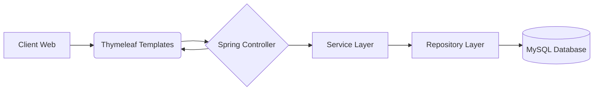

```markdown
<div align="center">
  
  
  
  # 🍽️ Campus Dang Food

  **Plateforme de Restauration Connectée – Yaoundé, Cameroun**

  [](https://adoptium.net/)
  [](https://spring.io/projects/spring-boot)
  [](https://www.mysql.com/)
  [](https://www.thymeleaf.org/)
  [](LICENSE)
  
  *Une solution tout-en-un pour la gestion des restaurants, menus, commandes et réservations*

  [Démo en ligne](#-démo-et-captures) • [Documentation](#-structure-du-projet) • [Guide d'installation](#-installation-et-exécution)

</div>

---

## 📖 Présentation Générale

**Campus Dang Food** est une application web complète développée dans le cadre d’un projet académique. Elle permet aux étudiants, professeurs et personnels du campus de découvrir l’offre gastronomique, de consulter les menus du jour, de réserver une table et de passer des commandes en ligne.

L’application se distingue par son **design raffiné** (dark mode, animations fluides, interface premium) et sa **robustesse technique** (Spring Boot, sécurité intégrée, architecture MVC).

---

## ✨ Fonctionnalités Clés

### 👥 Côté Public / Client
- 🏠 **Accueil dynamique** : Présentation des restaurants, statistiques, effets visuels (particules, orbes flottants)
- 🍽️ **Liste des restaurants** : Filtrage par type (Grillade, Restaurant, Bar) et notation par étoiles
- 📋 **Menus du jour** : Affichage par catégorie (Petit-déjeuner, Déjeuner, Dîner) avec détails des plats
- 🛒 **Panier de commande** : Ajout/suppression de plats, calcul automatique du total
- 💳 **Paiement simulé** : Interface claire avec choix MTN Mobile Money, Orange Money ou carte bancaire
- 🎫 **Génération de reçu** : Impression ou téléchargement PDF après commande
- 📅 **Réservation de table** : Sélection du restaurant, du créneau horaire, de la table et saisie coordonnées client

### 👨‍🍳 Côté Administration (Chef / Serveur)
- 🔐 **Authentification sécurisée** : Rôles `CHEF` et `SERVEUR` avec mots de passe encodés (BCrypt)
- 📊 **Dashboard** : Vue d’ensemble des restaurants et accès rapide à la gestion
- ➕ **Création de menus** : Ajout de menus (type, date) pour chaque restaurant
- 🍲 **Ajout de plats** : Nom, description, prix, catégorie (entrée, plat principal, dessert, boisson)
- 🔄 **Mise à jour en temps réel** : Les modifications apparaissent immédiatement sur le front-office

### 💾 Stockage et Données
- 🗄️ **Base MySQL** : Tables `restaurants`, `menus`, `plats_menu`, `utilisateurs`, `clients`
- 📦 **Persistance locale** : Les commandes, réservations et statistiques sont sauvegardées dans `localStorage` (démonstration)
- 🧹 **Initialisation automatique** : Chargement de données de démonstration via `CommandLineRunner`

---

## 🧱 Architecture Technique

Le projet suit une architecture **MVC (Modèle-Vue-Contrôleur)** classique de Spring Boot.



### Détail des couches :

| Couche          | Technologie / Rôle                                                                 |
|-----------------|------------------------------------------------------------------------------------|
| **Front-end**   | HTML5 / CSS3 (design custom), Thymeleaf, JavaScript (interactions, panier, localStorage) |
| **Contrôleurs** | `AccueilController`, `RestaurantController`, `AdminController`, `ReservationController`, `LoginController` |
| **Service**     | `RestaurantService`, `MenuService`, `PlatMenuService`, `ClientService`, `CustomUserDetailsService` |
| **Repository**  | JPA / Hibernate avec interfaces `CrudRepository`                                  |
| **Sécurité**    | Spring Security (form login, BCrypt, rôle-based access)                           |
| **Base de données** | MySQL Community Server 8.0                                                      |
| **Build**       | Maven                                                                             |

---

## 📁 Structure du Projet

```
src/
├── main/
│   ├── java/com/campusdang/restauration/
│   │   ├── config/               # SecurityConfig, DataInitializer
│   │   ├── controller/           # Accueil, Restaurant, Admin, Login, Reservation
│   │   ├── model/                # Restaurant, Menu, PlatMenu, Client, Utilisateur, enums
│   │   ├── repository/           # Interfaces JPA
│   │   └── service/              # Logique métier + CustomUserDetailsService
│   └── resources/
│       ├── application-mysql.properties
│       ├── templates/
│       │   ├── accueil/
│       │   ├── admin/
│       │   ├── restaurants/
│       │   ├── reservations/
│       │   ├── login.html
│       │   └── contact.html
│       └── static/               # (assets CSS/JS si nécessaire)
└── test/                         # Tests unitaires (optionnel)
```

---

## 💻 Installation et Exécution

### Prérequis

- **JDK 17** ou supérieur ([télécharger](https://adoptium.net/))
- **MySQL Community Server** ([télécharger](https://dev.mysql.com/downloads/mysql/))
- **Maven** (intégré dans les IDE comme IntelliJ ou VS Code)
- Navigateur web moderne (Chrome, Firefox, Edge)

### Étapes d’installation

1. **Cloner le dépôt**
   ```bash
   git clone https://github.com/votre-username/campus-dang-food.git
   cd campus-dang-food
   ```

2. **Créer la base de données MySQL**
   ```sql
   CREATE DATABASE campusdangdb CHARACTER SET utf8mb4 COLLATE utf8mb4_unicode_ci;
   ```

3. **Configurer l’accès MySQL**  
   Éditez le fichier `src/main/resources/application-mysql.properties` :
   ```properties
   spring.datasource.url=jdbc:mysql://localhost:3306/campusdangdb?useSSL=false&serverTimezone=UTC
   spring.datasource.username=votre_utilisateur
   spring.datasource.password=votre_mot_de_passe
   ```

4. **Lancer l’application**
   ```bash
   ./mvnw spring-boot:run
   ```
   *(Sous Windows : `mvnw.cmd spring-boot:run`)*

5. **Accéder à l’application**  
   Ouvrez votre navigateur à l’adresse : [http://localhost:8080](http://localhost:8080)

### 🔐 Comptes par défaut (administration)

| Rôle       | Email                    | Mot de passe |
|------------|--------------------------|--------------|
| Chef       | `chef@campusdang.cm`     | `chef123`    |
| Serveur    | `serveur@campusdang.cm`  | `serveur123` |

> ℹ️ Les mots de passe sont encodés avec BCrypt. Le client `jean@email.com` (mdp `123456`) est également créé.

---

## 📸 Démo et Captures

### Page d’accueil


*Fond animé, badges dorés, boutons d’appel à l’action.*

### Liste des restaurants


*Filtres par type, notes, horaires et spécialités.*

### Menu détaillé et panier


*Ajout de plats, ajustement des quantités, paiement intégré.*

### Interface d’administration


*Gestion des menus et des plats.*

---

## ⚙️ Technologies Utilisées (Détail)

| Catégorie          | Technologie(s)                                                                                 |
|--------------------|------------------------------------------------------------------------------------------------|
| Backend            | Java 17, Spring Boot 3.2, Spring MVC, Spring Data JPA, Spring Security                        |
| Frontend           | Thymeleaf, HTML5, CSS3 (Flexbox, Grid, animations), JavaScript (ES6)                          |
| Base de données    | MySQL, Hibernate                                                                              |
| Build & Dépendances| Maven, `pom.xml` avec spring-boot-starter-*, mysql-connector-java, thymeleaf-extras-springsecurity6 |
| UI/UX              | Police Google Fonts (Inter, Playfair Display), Font Awesome 6, design sombre/luxueux          |
| Outils de dev      | IntelliJ IDEA, Git, MySQL Workbench                                                           |

---

## 🌟 Points Forts du Projet

- ✅ **Sécurité** : Gestion de sessions, protection CSRF (désactivée pour H2 mais activable), rôles `CHEF` / `SERVEUR`
- ✅ **Responsive Design** : Adapté aux écrans de bureau, tablettes et mobiles
- ✅ **Expérience utilisateur** : Animations CSS (`hover`, `keyframes`), messages toast, transitions fluides
- ✅ **Code modulaire** : Séparation claire des responsabilités (contrôleurs, services, repositories)
- ✅ **Simulation de paiement** : Pas de vrai traitement bancaire mais expérience réaliste (reçu PDF)
- ✅ **Documentation complète** : Ce README, commentaires Java (entités), nommage clair

---

## 🚀 Améliorations Futures (Roadmap)

- [ ] Ajout d’une API REST pour exposer les données (consommable par une app mobile)
- [ ] Intégration d’un vrai gateway de paiement (Stripe, Orange Money API)
- [ ] Panneau d’administration avancé avec graphiques (Chart.js) sur les ventes
- [ ] Envoi d’emails de confirmation (Spring Mail)
- [ ] Tests unitaires et d’intégration (JUnit, MockMvc)
- [ ] Déploiement sur un cloud (AWS, Heroku, ou render.com)

---

## 🤝 Contribution

Ce projet a été réalisé dans un cadre pédagogique. Les contributions sont les bienvenues pour l’enrichir :

1. Forkez le projet
2. Créez votre branche (`git checkout -b feature/amazing-feature`)
3. Committez (`git commit -m 'Add some amazing feature'`)
4. Pushez (`git push origin feature/amazing-feature`)
5. Ouvrez une *Pull Request*

---

## 📄 Licence

Distribué sous licence MIT. Voir le fichier `LICENSE` pour plus d’informations.

---

## 👨‍💻 Auteur

**Votre Nom** – [@votre-pseudo](https://github.com/votre-pseudo)  
Projet réalisé pour le cours de **Développement d’applications web avec Spring Boot** – Année académique 2025/2026.

---

<div align="center">
  <sub>❤️ Développé avec passion pour la gastronomie camerounaise et les technologies modernes.</sub>
</div>
```

---

### 📌 Conseils pour personnaliser ce README :

1. **Remplacez** les `via.placeholder.com` par de *véritables captures d’écran* de votre application.  
   Vous pouvez utiliser un outil comme [CleanShot](https://cleanshot.com/) ou simplement `Win + Shift + S` (Windows) puis héberger les images dans un dossier `screenshots/` et y faire référence.

2. **Ajoutez un vrai logo** si vous en avez un, ou utilisez celui fourni (icône Font Awesome).

3. **Modifiez le nom de l’auteur et le lien GitHub** dans la section "Auteur".

4. **Testez les liens** : assurez-vous que `LICENSE` existe ou créez un fichier `LICENSE` avec le texte MIT.
